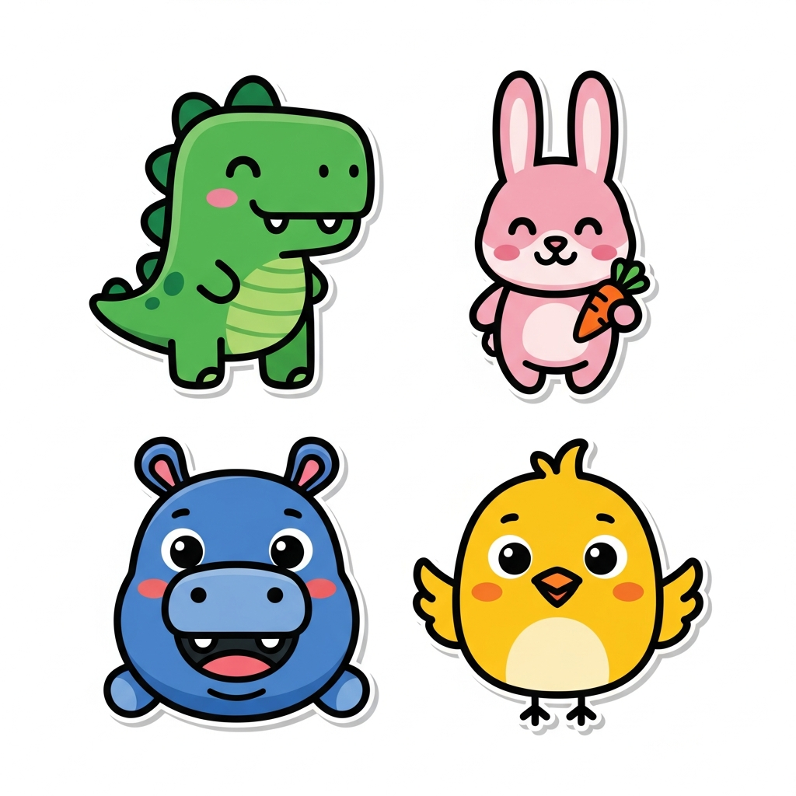

# 🎲 Dice Counting & Subtraction Funland

A joyful, touch-first math application designed for preschool learners (Ages 4-6). Built with love using React and Tailwind CSS.



## 🌟 Features

### 🧩 Core Modules
*   **Module A: Roll & Count**: Interactive 3D dice rolling. Children roll a die and count the pips by tapping them, reinforcing 1-to-1 correspondence.
*   **Module B: Jump Path**: A digital "number line" board game. Roll the dice to jump an avatar towards the finish line, teaching number sequencing and addition concepts.
*   **Module C: Feeding Time**: A playful subtraction story. "Feed" apples to hungry animal friends and see how many are left.

### 🎨 Design & Experience
*   **Touch-First**: Large touch targets (>48px) designed for small hands on tablets and touchscreens.
*   **No Reading Required**: Full audio voiceovers and sound effects guide the child through every step.
*   **Soft Pop Aesthetic**: Friendly colors, rounded shapes, and cute animal avatars (Dino 🦖, Mimi 🐰, Hugo 🐻, Pip 🐦).
*   **Offline Capable**: All assets are local; works without an internet connection after loading.

## 🛠️ Technology Stack

*   **Frontend**: [React](https://react.dev/) + [Vite](https://vitejs.dev/)
*   **Styling**: [Tailwind CSS v4](https://tailwindcss.com/)
*   **Animations**: [Framer Motion](https://www.framer.com/motion/)
*   **State Management**: [Zustand](https://github.com/pmndrs/zustand)
*   **Routing**: [Wouter](https://github.com/molefrog/wouter)
*   **Audio**: Web Audio API (Synthesized & SFX)

## 🚀 Getting Started

### Prerequisites
*   Node.js (v18 or higher)
*   npm or yarn

### Installation

1.  Clone the repository:
    ```bash
    git clone https://github.com/your-username/dice-counting-funland.git
    cd dice-counting-funland
    ```

2.  Install dependencies:
    ```bash
    npm install
    ```

3.  Start the development server:
    ```bash
    npm run dev:client
    ```

4.  Open your browser at `http://localhost:5000`.

## 📁 Project Structure

```
client/
├── src/
│   ├── components/
│   │   ├── ui/           # Reusable UI components (Buttons, Avatars, Dice)
│   │   └── layout/       # Game layout wrappers
│   ├── pages/            # Game modules (Home, Count, Jump, Feed)
│   ├── lib/              # Utilities, Stores, Audio Manager
│   └── App.tsx           # Main Router
└── index.html            # Entry point
```

## 🤝 Contributing

We welcome contributions! Please feel free to submit a Pull Request.

1.  Fork the project
2.  Create your feature branch (`git checkout -b feature/AmazingFeature`)
3.  Commit your changes (`git commit -m 'Add some AmazingFeature'`)
4.  Push to the branch (`git push origin feature/AmazingFeature`)
5.  Open a Pull Request

## 📄 License

This project is licensed under the MIT License - see the [LICENSE](LICENSE) file for details.
